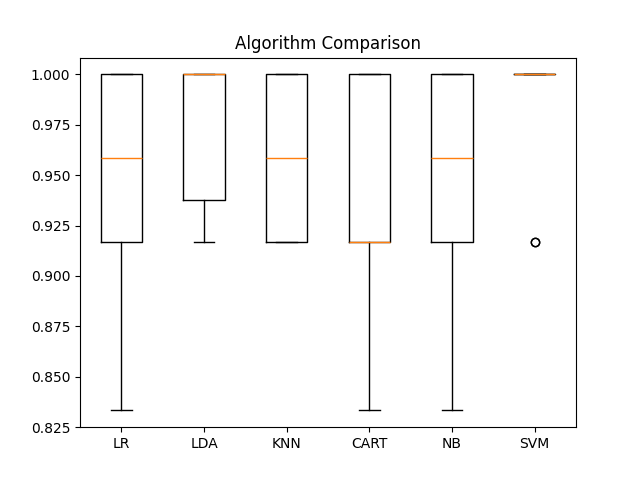

# Machine Learning Project
## Data Exploration
I loaded the Iris dataset from a URL and examined its shape, displaying the first 20 rows and obtaining descriptive statistics. The dataset contains 150 instances and 5 columns: 'sepal-length', 'sepal-width', 'petal-length', 'petal-width', and 'class'. The 'class' column indicates the species of iris flowers: 'Iris-setosa', 'Iris-versicolor', and 'Iris-virginica'. The class distribution shows that each species has 50 instances, making it a balanced dataset.

### Data
(150, 5)
    sepal-length  sepal-width  ...  petal-width        class
0            5.1          3.5  ...          0.2  Iris-setosa      
1            4.9          3.0  ...          0.2  Iris-setosa      
2            4.7          3.2  ...          0.2  Iris-setosa      
3            4.6          3.1  ...          0.2  Iris-setosa      
4            5.0          3.6  ...          0.2  Iris-setosa      
5            5.4          3.9  ...          0.4  Iris-setosa      
6            4.6          3.4  ...          0.3  Iris-setosa      
7            5.0          3.4  ...          0.2  Iris-setosa      
8            4.4          2.9  ...          0.2  Iris-setosa      
9            4.9          3.1  ...          0.1  Iris-setosa      
10           5.4          3.7  ...          0.2  Iris-setosa      
11           4.8          3.4  ...          0.2  Iris-setosa      
12           4.8          3.0  ...          0.1  Iris-setosa      
13           4.3          3.0  ...          0.1  Iris-setosa      
14           5.8          4.0  ...          0.2  Iris-setosa      
15           5.7          4.4  ...          0.4  Iris-setosa      
16           5.4          3.9  ...          0.4  Iris-setosa      
17           5.1          3.5  ...          0.3  Iris-setosa      
18           5.7          3.8  ...          0.3  Iris-setosa      
19           5.1          3.8  ...          0.3  Iris-setosa      

[20 rows x 5 columns]
       sepal-length  sepal-width  petal-length  petal-width
count    150.000000   150.000000    150.000000   150.000000       
mean       5.843333     3.054000      3.758667     1.198667       
std        0.828066     0.433594      1.764420     0.763161       
min        4.300000     2.000000      1.000000     0.100000       
25%        5.100000     2.800000      1.600000     0.300000       
50%        5.800000     3.000000      4.350000     1.300000       
75%        6.400000     3.300000      5.100000     1.800000       
max        7.900000     4.400000      6.900000     2.500000       
class
Iris-setosa        50
Iris-versicolor    50
Iris-virginica     50

## Model Evaluation
I split the dataset into training and validation sets (80% training, 20% validation) and evaluated six different classification algorithms using stratified k-fold cross-validation with 10 folds. The evaluated algorithms are Logistic Regression (LR), Linear Discriminant Analysis (LDA), K-Nearest Neighbors (KNN), Decision Tree (CART), Gaussian Naive Bayes (NB), and Support Vector Machine (SVM). The accuracy scores of the models range from approximately 0.94 to 0.98, indicating high performance on the training data. SVM achieved the highest accuracy of approximately 0.98, followed by LDA with approximately 0.98. The boxplot visualization compares the accuracy distributions of the different algorithms.

### Data
    LR: 0.941667 (0.065085)
    LDA: 0.975000 (0.038188)
    KNN: 0.958333 (0.041667)
    CART: 0.950000 (0.040825)
    NB: 0.950000 (0.055277)
    SVM: 0.983333 (0.033333)

## Model Validation
I selected the SVM algorithm as the final model and made predictions on the validation dataset. The accuracy of the SVM model on the validation set is approximately 0.97, indicating good generalization performance. The confusion matrix shows the counts of true positive, false positive, true negative, and false negative predictions for each class. The classification report provides precision, recall, F1-score, and support for each class, as well as macro and weighted averages. The high precision, recall, and F1-score values indicate that the model performs well for all three classes, with the highest scores for 'Iris-setosa'.

### Data
                 precision    recall  f1-score   support

    Iris-setosa       1.00      1.00      1.00        11
    Iris-versicolor   1.00      0.92      0.96        13
    Iris-virginica    0.86      1.00      0.92         6

       accuracy                           0.97        30
      macro avg       0.95      0.97      0.96        30
    weighted avg      0.97      0.97      0.97        30
